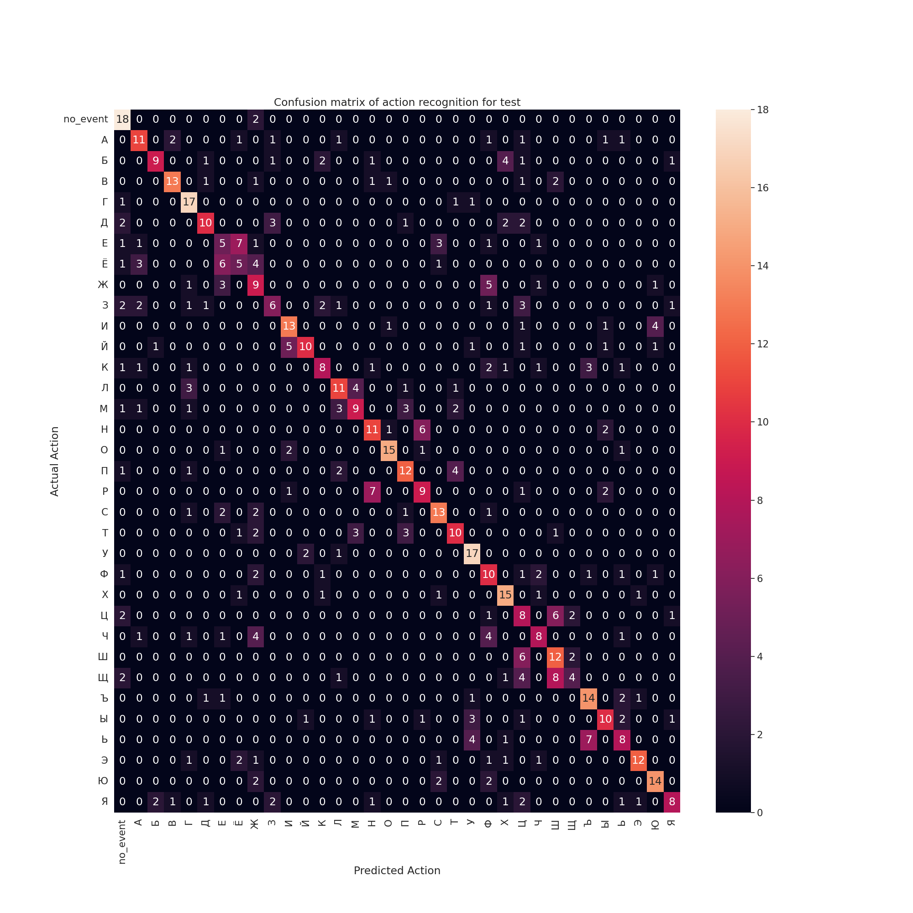

# MobileNetV2-TSM
## Description
Implementation of [Temporal Shift Module](https://arxiv.org/abs/1811.08383) using tensorflow.  
[Bukva: Russian Sign Language Alphabet Dataset](https://github.com/ai-forever/bukva) was used for model training.  
Because of how TSM works, there is a huge RAM consumption during model training (up to 28 Gb with shuffle on and batch_size = 16). 
 
#### Memory consumption can be lowered by:
- Lowering batch size
- Turning off or lowering shuffle batch size
- Adjusting dataset prefetch
- Lowering number of segments
- Freezing some of the MobileNet blocks (check in the notebook)
 
You might also try to replicate inplace shift from TSM repository. It can be done using custom gradient, however, this might lower the accuracy significantly.

## Metrics

Current implementation has 53.5% accuracy on test data.

Confusion matrix of current implementation:

