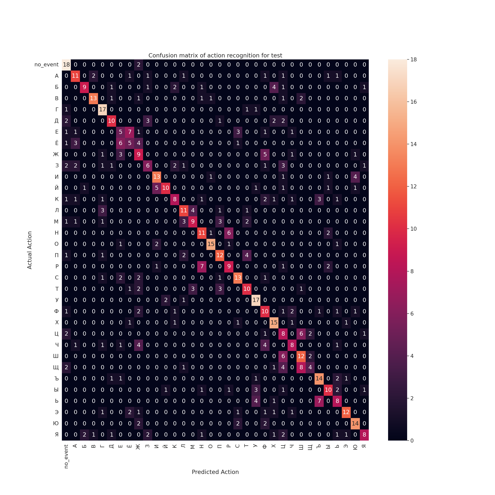

# MobileNetV2-TSM

## Description
Implementation of [Temporal Shift Module](https://arxiv.org/abs/1811.08383) using tensorflow.  
[Bukva: Russian Sign Language Alphabet Dataset](https://github.com/ai-forever/bukva) was used for model training.  

## How to use it

If you want to use the same training pipeline as in this repo, you should use ffmpeg to turn your videos to sequence of jpg frames [like in this script](https://github.com/mit-han-lab/temporal-shift-module/blob/master/tools/vid2img_sthv2.py) from the creators of original TSM paper. 
This will create *num of videos* folders with frames of certain videos. After this, just chnge the ROOT_DIR to the root directory, containing. 
Alternatively, you can use OpenCV library. 

#### Model training is done in 2 stages:
- Training with frozen conv base
- Training with cosine decay

Because of how TSM works, there is a huge RAM consumption during model training (up to 28 Gb with shuffle on and batch_size = 16). 
 
#### Memory consumption can be lowered by:
- Lowering batch size
- Turning off or lowering shuffle batch size
- Adjusting dataset prefetch
- Lowering number of segments
- Freezing some of the MobileNet blocks (check in the notebook)
 
You might also try to replicate inplace shift from TSM repository. It can be done using custom gradient, however, this might lower the accuracy significantly.

## Models

Repository contains pretrained model in saved_model and tflite formats. You might need to specify num_segments as 8 when loading saved_model format.

#### Current implementation has 53.5% accuracy on test data.

#### Confusion matrix of current implementation:

